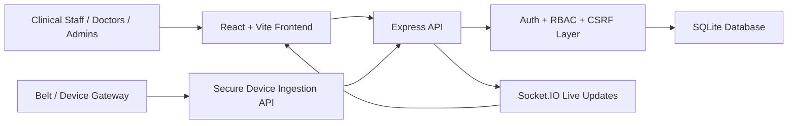
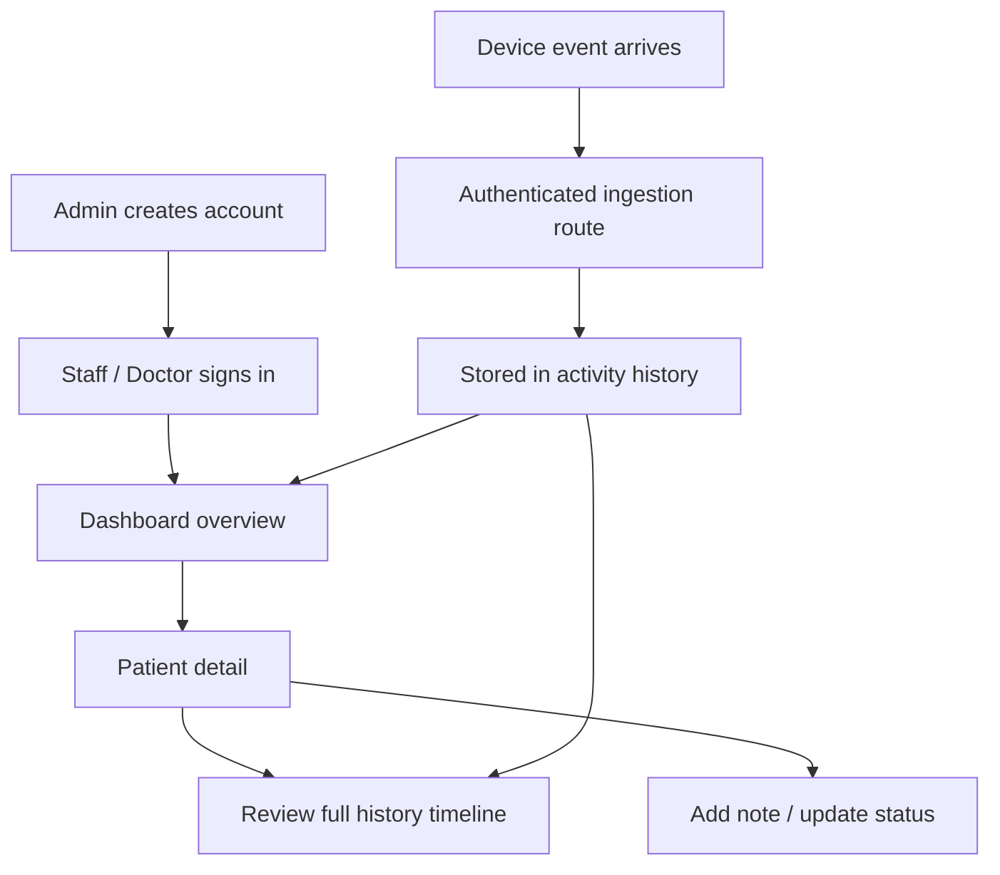

# SHMF

<div align="center">

## Sentinel Health Monitoring Framework

### Secure hospital operations, live patient visibility, and role-aware clinical workflows in one modern dashboard.

[](https://react.dev/)
[](https://nodejs.org/)
[](https://www.sqlite.org/)
[](#security-foundation)
[](#deploy-with-docker)

<p>
  <strong>Built for calmer clinical workflows.</strong><br />
  SHMF blends secure authentication, patient timelines, device event ingestion, staff roles, and hospital-grade UI into a single deployable platform.
</p>

</div>

---

## Why SHMF Feels Different

Most hospital dashboards either feel too raw for production or too cluttered for actual care workflows. SHMF is designed to sit in the middle: secure enough to harden, clean enough to trust, and fast enough for operators, staff, and doctors who need answers immediately.

### What this version delivers

- `admin / doctor / staff` role-aware product flows
- Cookie-based auth with refresh sessions and CSRF protection
- Admin-only account creation and lifecycle control
- Unified patient history timeline with notes and belt/device events
- Audit visibility, profile settings, and system configuration
- Docker/VPS-ready deployment structure
- A redesigned hospital UI with stronger contrast, calmer layout, and better task scanning

---

## Visual Snapshot

```text
┌──────────────────────────────────────────────────────────────────────────┐
│ SHMF                                                                    │
│ Secure Clinical Operations Console                                      │
├───────────────┬──────────────────────────────────────────────────────────┤
│ Navigation    │ Dashboard                                                │
│ • Overview    │ • occupancy snapshot                                     │
│ • Patients    │ • live alerts                                            │
│ • Users       │ • patient movement                                       │
│ • Audit       │ • quick access to history                                │
│ • Settings    │                                                          │
├───────────────┼──────────────────────────────────────────────────────────┤
│ Patient View  │ Unified timeline                                         │
│ • profile     │ • clinical notes                                         │
│ • vitals      │ • staff actions                                          │
│ • assignments │ • belt / device alerts                                   │
│ • history     │ • chronological review                                   │
└───────────────┴──────────────────────────────────────────────────────────┘
```

---

## Product Story

### 1. Secure Login Experience

- Clean hospital-style entry screen
- Secure access messaging and clearer focus states
- No public registration route
- Account provisioning restricted to admins

### 2. Operational Dashboard

- Real-time cards for active patients and room load
- Faster scanability for activity and event pressure
- Cleaner visual rhythm for shift use on laptop screens

### 3. Patient History Timeline

- Single chronological view for notes and device signals
- Better story of what happened, when it happened, and who recorded it
- Easier handoff support between staff and doctors

### 4. Admin Control Center

- User creation, role assignment, enable/disable actions
- System settings and hospital configuration
- Audit visibility for operational accountability

---

## Architecture At A Glance



---

## Security Foundation

SHMF is no longer a demo-style localStorage auth app. This version hardens the platform around safer defaults and cleaner operational boundaries.

### Security improvements included

- `httpOnly` cookie-based auth flow
- refresh session model
- CSRF protection for state-changing requests
- bcrypt password hashing with stronger policy checks
- account lockout support and safer auth responses
- Helmet hardening and tighter security headers
- rate limiting on sensitive routes
- device ingestion separated from human login flows
- audit logging for sensitive actions

---

## Role Model

| Role | Core Access |
|------|-------------|
| `admin` | Full user management, audit access, system settings, patient operations |
| `doctor` | Review patients, add clinical notes, inspect timeline and activity |
| `staff` | Operational patient updates, timeline review, limited workflow actions |

---

## Clinical Workflow Map



---

## Feature Highlights

### Patient History That Actually Reads Well

Instead of scattering information across separate notes and event pages, SHMF assembles a clearer patient history timeline. Staff can follow actions chronologically, doctors can review context faster, and administrators can investigate with less friction.

### Better UI For Real Use

The interface now emphasizes:

- stronger typography hierarchy
- cleaner cards and spacing
- calmer, medical-grade color direction
- better mobile and tablet adaptation
- less demo-noise and more practical clarity

### Deployment Without Guesswork

The repository includes Docker assets, environment templates, nginx configuration, and a backend/frontend structure ready for VPS hosting.

---

## Tech Stack

### Frontend

- React
- React Router
- Axios
- Socket.IO Client
- Vite

### Backend

- Node.js
- Express
- SQLite
- Socket.IO
- Helmet
- Cookie Parser
- Rate Limiting

### Deployment

- Docker
- Docker Compose
- Nginx

---

## Repository Layout

```text
PGS/
├─ backend/
│  ├─ lib/
│  ├─ middleware/
│  ├─ routes/
│  ├─ tests/
│  ├─ .env.example
│  ├─ Dockerfile
│  ├─ db.js
│  └─ server.js
├─ frontend/
│  ├─ src/
│  │  ├─ components/
│  │  ├─ pages/
│  │  └─ services/
│  ├─ .env.example
│  ├─ Dockerfile
│  ├─ nginx.conf
│  └─ vite.config.mjs
├─ docker-compose.yml
└─ README.md
```

---

## Local Development

### Start the backend

```bash
cd backend
npm install
npm start
```

### Start the frontend

```bash
cd frontend
npm install
npm run dev
```

### Local URLs

- Frontend: [http://127.0.0.1:5173](http://127.0.0.1:5173)
- Backend: [http://127.0.0.1:4000](http://127.0.0.1:4000)

---

## Environment Setup

Use the example files as the starting point:

- `backend/.env.example`
- `frontend/.env.example`

### Important backend configuration

- bootstrap admin username and password
- access token secret
- refresh token secret
- CSRF settings
- device API key
- session expiration values
- rate limit settings

---

## Deploy With Docker

```bash
docker compose up --build
```

### Included deployment assets

- `docker-compose.yml`
- `backend/Dockerfile`
- `frontend/Dockerfile`
- `frontend/nginx.conf`

---

## Verification

### Frontend production build

```bash
cd frontend
npm run build
```

### Backend test suite

```bash
cd backend
npm test
```

---

## Device Ingestion

SHMF supports secure patient belt/device event ingestion without mixing device traffic into the human user login flow.

Relevant implementation files:

- `backend/routes/device.js`
- `backend/bluetooth_gateway.py`
- `backend/belt-simulator.js`

---

## Screens To Explore

- `Login` for secure hospital access
- `Dashboard` for occupancy and event visibility
- `Patient Detail` for history timeline and notes
- `Admin Users` for staff and doctor account management
- `Admin Settings` for system configuration
- `Audit Logs` for accountability review
- `Profile Settings` for user preferences and account updates

---

## Roadmap

- richer patient filtering and search
- stronger reporting and analytics exports
- email-driven password reset
- PostgreSQL migration path for larger deployments
- expanded assignment workflows for wards and units

---

## Design Direction

The current design system aims for:

- clinical calm over dashboard noise
- stronger information hierarchy over decorative clutter
- premium hospital styling without sacrificing usability
- security-first flows that still feel welcoming

---

## Built For

- hospital administration teams
- nursing and support staff
- doctors reviewing patient context
- operators monitoring wearable or belt-based event streams

---

<div align="center">

### SHMF helps teams move from scattered events to readable patient stories.

`Secure by default` • `role-aware by design` • `deployable from the repo`

</div>
